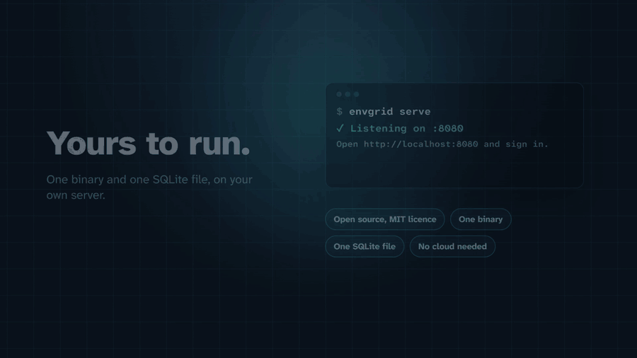

<p align="center">
  
</p>

<h1 align="center">envgrid</h1>

<p align="center"><strong>Every key, in every environment, side by side.</strong></p>

<p align="center">
  <a href="LICENSE"></a>
  <a href="https://github.com/Achal13jain/envgrid/releases/latest"></a>
  <a href="go.mod"></a>
  <a href="https://github.com/Achal13jain/envgrid/pkgs/container/envgrid"></a>
</p>

<p align="center">
  <a href="https://envgrid.pages.dev/">Website</a> &nbsp;|&nbsp;
  <a href="#quick-start">Quick start</a> &nbsp;|&nbsp;
  <a href="docs/features.md">Features</a> &nbsp;|&nbsp;
  <a href="docs/configuration.md">Configuration</a> &nbsp;|&nbsp;
  <a href="SECURITY.md">Security</a> &nbsp;|&nbsp;
  <a href="https://github.com/Achal13jain/envgrid/releases">Releases</a>
</p>

envgrid is a small, self-hosted place for a team to keep environment variables, constants and config files for each of its environments, such as test, uat and prod. Keys are rows, environments are columns, and every missing value is marked, so you see what prod lacks before it ships. It is one binary and one SQLite file.

<p align="center">
  <a href="https://github.com/Achal13jain/envgrid/releases/tag/media"></a>
</p>

## Quick start

### With Docker

First generate a master key. envgrid encrypts every value with it, so save it in your password manager before you go on.

```sh
docker run --rm ghcr.io/achal13jain/envgrid genkey
```

Then start envgrid with that key and the email and password of the first admin:

```sh
docker run -d --name envgrid -p 8080:8080 -v envgrid-data:/data \
  -e ENVGRID_MASTER_KEY='paste-the-key-here' \
  -e ENVGRID_ADMIN_EMAIL=you@example.com \
  -e ENVGRID_ADMIN_PASSWORD='choose-a-long-password' \
  -e ENVGRID_SECURE_COOKIES=false \
  ghcr.io/achal13jain/envgrid
```

Open http://localhost:8080 and choose Sign in. To look around with demo data first, run `docker exec envgrid /envgrid seed`, which creates a repo called `acme-shop` with three environments, two files and some missing and differing values.

`ENVGRID_SECURE_COOKIES=false` lets you try envgrid over plain HTTP. Remove it once envgrid is behind HTTPS.

You can also use `docker-compose.yml` with a `.env` file based on `.env.example`.

### Without Docker

envgrid is one program. These scripts download the latest release for your system, check it against the release's checksums file (which catches a damaged download) and put it on your PATH.

```sh
# Linux and macOS
curl -fsSL https://raw.githubusercontent.com/Achal13jain/envgrid/main/install.sh | sh
```

```powershell
# Windows (PowerShell)
irm https://raw.githubusercontent.com/Achal13jain/envgrid/main/install.ps1 | iex
```

Then make a key and start it:

```sh
envgrid genkey          # prints a new key; save it
export ENVGRID_MASTER_KEY='paste-the-key-here'
export ENVGRID_DATA_DIR=./data
export ENVGRID_SECURE_COOKIES=false
ENVGRID_ADMIN_EMAIL=you@example.com ENVGRID_ADMIN_PASSWORD='choose-a-long-password' envgrid
```

You can also download the archive for your system from the [latest release](https://github.com/Achal13jain/envgrid/releases/latest). The docs page explains running envgrid as a service, giving your team access, and Windows commands.

If you start envgrid without a master key, it prints a freshly generated one with instructions and exits without touching any data.

## Learn more

- [Features](docs/features.md): what envgrid does and does not do, and what is planned.
- [Configuration and operations](docs/configuration.md): settings, the command line client, backups and building from source.
- [Security](SECURITY.md): how to report a problem, roles, and how values, passwords and sessions are protected.
- [API](docs/api.md): the JSON API the web interface uses.
- [Contributing](CONTRIBUTING.md): building from source, the checks CI runs, and the rules every change follows.
- The full setup guide, including running envgrid as a service and giving your team access, is at `/docs` on every envgrid server and on the website.

## Licence

MIT. See [LICENSE](LICENSE). The code and fonts built into envgrid are listed with their licences in [THIRD_PARTY_NOTICES.md](THIRD_PARTY_NOTICES.md).

Built by [Achal Jain](https://github.com/Achal13jain).
